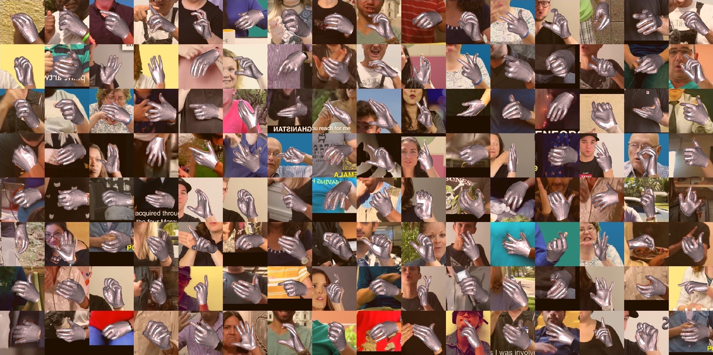

# YouTube 3D Hands (YT 3D)

The official repository for the dataset introduced in the **CVPR 2020 (Oral)** paper  
[Weakly-Supervised Mesh-Convolutional Hand Reconstruction in the Wild](https://openaccess.thecvf.com/content_CVPR_2020/papers/Kulon_Weakly-Supervised_Mesh-Convolutional_Hand_Reconstruction_in_the_Wild_CVPR_2020_paper.pdf)  
by Dominik Kulon, Riza Alp Güler, Iasonas Kokkinos, Michael Bronstein, Stefanos Zafeiriou

Project website: https://www.arielai.com/mesh_hands/

## Preview



The dataset contains 3D vertex coordinates of 50,175 hand meshes aligned with in the wild images comprising hundreds of subjects performing a wide variety of tasks.

The training set was generated from 102 videos resulting in 47,125 hand annotations. The validation and test sets cover 7 videos with an empty intersection of subjects with the training set and contain 1,525 samples each.

The dataset has been collected in a fully automated manner. Please, refer to our paper for the details.

## Dataset Request Form

The dataset is published in the form of JSON files containing mesh annotations. The size of compressed files is approximately 800 MB.

The dataset is available exclusively to persons affiliated with academic research institutions (PhD/Master's students, postdocs, faculty members,  and researchers), **exclusively for research purposes**, as detailed in the [LICENSE](./LICENSE) document. You will need to provide a valid institutional email. 

To access the dataset, please, fill out the provided request form: [Dataset Request Form](https://forms.gle/U385D7b7Qfrig9NR9).

## Data Format

To load the JSON dataset, please, check the `load_dataset` method in [load_db.py](./load_db.py). The JSON files are assumed to be placed in `./data/`.

JSON files have the following format:
- `images`
  - `name` - Image name in the form of `youtube/VIDEO_ID/video/frames/FRAME_ID.png`.
  - `width` - Width of the image.
  - `height` - Height of the image.
  - `id` - Image ID.
- `annotations`
  - `vertices` - 3D vertex coordinates.
  - `is_left` - Binary value indicating a right/left hand side.
  - `image_id` - ID to the corresponding entry in `images`.
  - `id` - Annotation ID (an image can contain multiple hands).

The order of vertices corresponds to [MANO](http://mano.is.tue.mpg.de/). Mesh faces can be downloaded from their website.   

### Evaluation details:

In the paper, the error on the YouTube dataset is measured in px. Pose Error on the YouTube dataset is evaluated on 2D OpenPose landmarks while MAE and Mesh Error are evaluated on 3D vertices (all without rigid alignment).  

We suggest using the test set mainly for self-comparison. Otherwise, running OpenPose on the images and comparing against Pose Error will result in a perfect score. Similarly, fitting MANO to OpenPose predictions with our proposed method will result in a perfect score on 3D evaluation metrics.

## Images

The repository contains a code example of using the pytube and OpenCV libraries to extract video frames which is not part of the licensed publication. The following software is required to run the code: 

Python  
[pytube](https://github.com/nficano/pytube)  
opencv-python  

Commands to run the example:

```
# Download a specific video.
python download_images.py --vid VIDEO_ID

# Download all videos from the training set.
python download_images.py --set train

# Download all videos from the test and validation sets.
python download_images.py --set test
```

We cannot provide any support if a video is protected or no longer accessible. 

After downloading video frames, you can check the `viz_sample` method in [load_db.py](./load_db.py) to retrieve and visualize a specific sample.

## License

If you use the dataset, please, make sure you are familiar with the [LICENSE](./LICENSE) and cite our paper. In particular, the [LICENSE](./LICENSE) forbids any commercial use including training neural networks/algorithms/systems/etc. for commercial purposes.

```
@InProceedings{Kulon_2020_CVPR,  
   author = {Kulon, Dominik and 
             Guler, Riza Alp and
             Kokkinos, Iasonas and
             Bronstein, Michael M. and
             Zafeiriou, Stefanos},  
   title = {Weakly-Supervised Mesh-Convolutional Hand Reconstruction in the Wild},  
   booktitle = {The IEEE/CVF Conference on Computer Vision and Pattern Recognition (CVPR)},  
   month = {June},  
   year = {2020}  
}
```

Ground truth annotations are also derivatives of [MANO](http://mano.is.tue.mpg.de/) which is under its own license.
